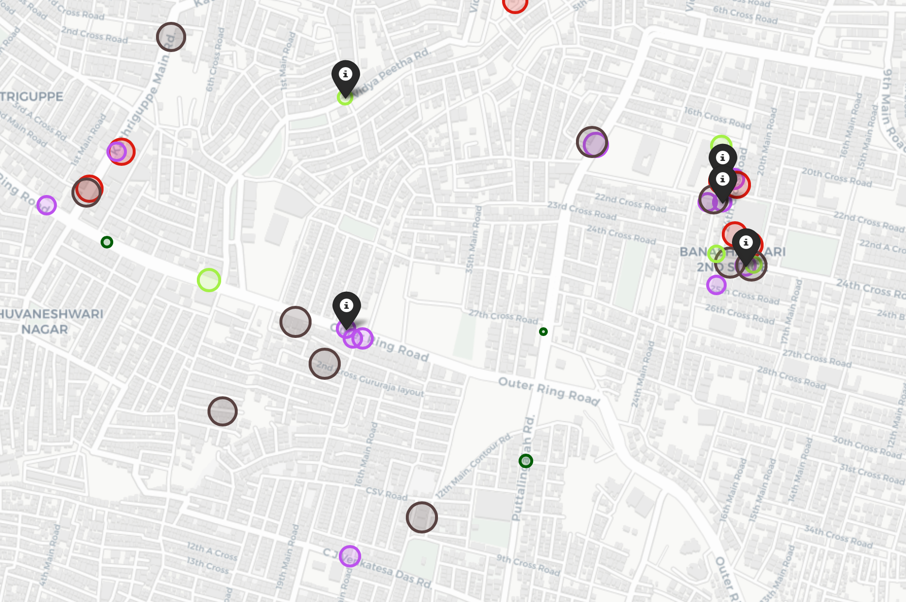

# Exploratory Analysis of Geolocational Data

This project, titled "Exploratory Analysis of Geolocational Data," focuses on leveraging geolocational data to find the best accommodation options for students in Bangalore. We employ K-Means Clustering, a popular unsupervised machine learning technique, to group student data based on various factors, including food choices, nutrition, preferences, childhood favorites, and other personal information collected from college students. This exploratory analysis aims to provide valuable insights and recommendations for students searching for accommodation, making their transition to Bangalore more comfortable and enjoyable.

## Introduction

Choosing the right accommodation in a new city is a crucial decision for students. This project helps students in Bangalore make informed choices by utilizing geolocational data and clustering techniques. K-Means Clustering is employed to group students with similar profiles, considering factors like food choices, nutrition, preferences, and childhood favorites. By analyzing these clusters, we identify patterns and similarities among students, allowing us to suggest suitable accommodation options that align with their lifestyles and preferences.

## Requirements

Before using this project, ensure you have the following dependencies installed:

- Python 3.x
- Jupyter Notebook (for exploring the dataset)
- scikit-learn (for K-Means Clustering)
- Pandas (for data manipulation)
- Matplotlib and Seaborn (for data visualization)
- Folium (for interactive map visualization)

Install these dependencies using pip -

```bash
pip install scikit-learn pandas matplotlib seaborn folium
```

## Data Sources

Our analysis relies on two primary data sources:

1. Student Survey Data: This dataset includes information on food preferences, nutritional choices, and other personal preferences from college students in Bangalore. This data helps us understand the needs and preferences of potential residents.

2. Foursquare API: We use the Foursquare API to collect information about venues and amenities in various neighborhoods of Bangalore. This data enables us to assess the availability of essential services and entertainment options in different areas.

## K-Means Clustering

K-Means Clustering is employed to segment Bangalore neighborhoods into clusters with similar characteristics. The clustering process considers both student preferences and the availability of venues from the Foursquare API. This allows us to recommend accommodations that align with students' needs and interests.

## Results 

The results of our analysis is presented in a user-friendly format, providing students in Bangalore with valuable information about the best accommodation options based on their preferences.

<div align = "center">
<kbd>

</kbd>
</div>

